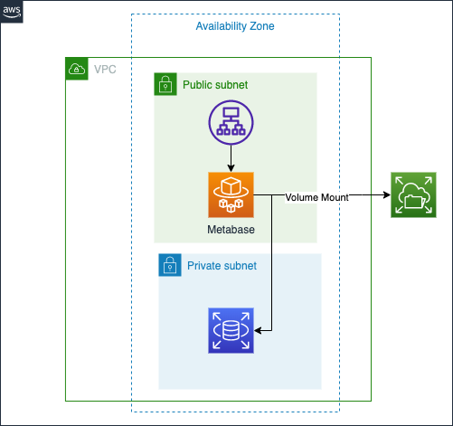

# metabase_ecs
This repository is showing how to store `Metabase` data which running ECS on Fargate.

## Description
All AWS resources are created by Terraform, see [Deployment section](#Deployment).
Architecture is below.



1. VPC has two subnet sets, public and private respectively.
2. ALB is accessible from the internet and forwards requests to ECS.
3. ECS (on Fargate) is corresponding to Metabase application.
4. EFS is store Metabase data permanently. So if ECS is down, Metabase data is not lost.
5. RDS is in private subnet. ECS can access to RDS via Security Group.

## Deployment

1. Install Terraform and AWS CLI your local machine.
2. Create RDS user and password by below aws-cli command.
```zsh
% aws ssm put-parameter \
    --name "/metabase/rds/mysql/username" \
    --description "rds username" \
    --value "xxxxx" \
    --type String

% aws ssm put-parameter \
    --name "/metabase/rds/mysql/password" \
    --description "rds password" \
    --value "xxxxxxxxxxxx" \
    --type SecureString
```

3. Apply Terraform.
```zsh
% cd terraform
% terraform init
% terraform apply
```
